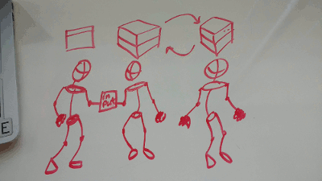

JEN Stack Start
===

Setup server
---

Install Noe/Express:

- Initialize npm: ```npm init```
- Install express for routes: ```npm install express --save```

Get our server up and listening:

- create 'server.js'
- require express
- setup an express app

```
var express = require( 'express' );
var app = express();
```

- tell app to listen on a port

```
// listen
app.listen( 5678, function(){
  console.log( 'server up on 5678' );
});
```

- start up server an make sure it is listening
- in terminal: ```node server.js```

Set up base url route:
```
// base url
app.get( '/', function( req, res ){
  console.log( 'base url hit' );
  res.send( 'I came from the server!!!!' );
}); // end base url
```

- open 'localhost:5678' in browser
- should see "I came from the server!!!!" in browser
- should see "base url hit" in the terminal

Respond with HTML:

- create "views" folder
- create "index.html" within this folder
- put some html in there
- add ```var path = require( 'path' );``` at top of server file with other requires
- change res.send line to ```res.sendFile( path.resolve( 'views/index.html' ) );```
- restarted server
- reload page
- behold awesome

Add JS/JQ:

- create "public" folder in root
- create "scripts" folder in "public"
- create client side js in "scripts"
- Set public folder to be "static" using express: ```app.use( express.static( 'public' ) );```
- source in JS in html: ```<script src="scripts/songs.js" charset="utf-8"></script>```
- restart server
- reload page
- check that sourcing worked
- repeat for jquery


Set up HTML interface
Handle user input
Create Object to send to Server

DO a little play:



Setup for POST:

- install body-parser in terminal (stop server if running): ```npm install body-parser --save```
- require body parser in server file: ```var bodyParser = require( 'body-parser' );```
- set up the app.use for bodyParser: ```app.use( bodyParser.urlencoded( { extended: true } ) );```

Our first post:

In server file:
```
app.post( '/newSong', function( req, res ){
  console.log( 'post hit to /newSong:', req.body );
  songs.push( req.body );
  res.send( 'meow' );
});
```

In client js file, update on click for button:
```
$( '#addSongButton' ).on( 'click', function(){
  console.log( 'in addSongButton on click' );
  // get user input
  // create an object to send to server
  var objectToSend = {
    song: $( '#songIn' ).val(),
    artist: $( '#artistIn' ).val()
  }; // end objectToSend
  console.log( 'sending:', objectToSend );
  // use AJAX to send Object to server
  $.ajax({
    type: 'POST',
    url: '/newSong',
    data: objectToSend,
    success: function( response ){
      console.log( 'back from post:', response );
    } // end success
  }); //end ajax
}); // end addSongButton on click
```
